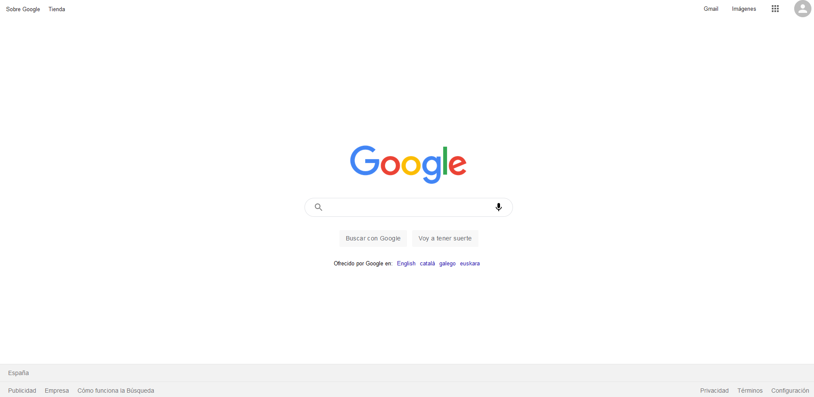

# Google Clone

Clon del buscador de google, estilos y búsqueda con su api propia.

## Funcionamiento

**Front end:**

`npm install `

`npm start`

**importante!**, colocar las keys de la api de google en ` src/config/keys.js` o crear en la raíz `.env`.

Por defecto utiliza una data estática.

## Stack:

**Front end:**

- react-router-dom
- Hooks
- Context

## Screens

**Home**

**Form add/update**

